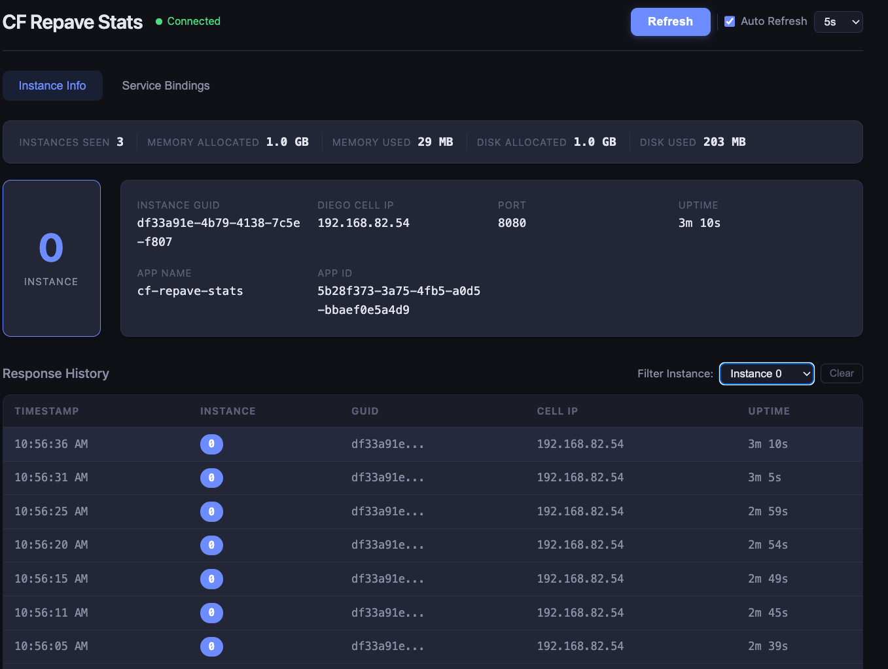

# CF Repave Stats

A Spring Boot dashboard that visualizes Cloud Foundry application instance details in real time. Designed to demonstrate application resilience during BOSH repave operations — watch instances cycle across Diego cells as the platform rotates VMs underneath your app.



## What It Shows

**Instance Info tab:**
- Large color-coded instance index badge (each instance gets a distinct color)
- Instance GUID, Diego Cell IP, port, and uptime
- App-level stats bar: instances seen, memory/disk allocated and used
- Response history table (last 50 responses) showing which instance served each request
- Instance filter to pin requests to a specific instance and track it across repaves
- Manual refresh button and configurable auto-refresh (5s / 10s / 15s / 30s)

**Service Bindings tab:**
- Card layout of all bound services with name, label, plan, and tags

## Prerequisites

- Java 17+
- Maven 3.8+ (or use the included `mvnw` wrapper)
- Cloud Foundry CLI (`cf`) with a targeted org/space
- A TAS/CF foundation to deploy to

## Build

```bash
./mvnw clean package
```

## Run Locally

```bash
./mvnw spring-boot:run
```

Open [http://localhost:8080](http://localhost:8080). When running locally, CF environment variables aren't present so the app displays sensible defaults (instance index 0, IP 127.0.0.1, etc.). The instance filter feature requires deployment to CF to work (it uses the `X-Cf-App-Instance` GoRouter header).

## Deploy to Cloud Foundry

```bash
cf push
```

This uses `manifest.yml` which configures:
- **3 instances** by default
- **1 GB memory** per instance
- **random-route** for a unique URL
- **HTTP health check** via Spring Boot Actuator (`/actuator/health`)

## Scale Up to See Load Balancing

```bash
cf scale cf-repave-stats -i 5
```

Click **Refresh** (or enable **Auto Refresh**) and watch the response history table — each row shows which instance index and Diego Cell IP served the request. With multiple instances you'll see requests round-robin across them.

## Instance Filter

Use the **Filter Instance** dropdown above the response history table to pin all requests to a specific instance index. This uses the CF GoRouter's `X-Cf-App-Instance` header to route directly to that instance.

This is particularly useful during repaves:
- Select e.g. **Instance 0** from the filter dropdown
- Enable auto-refresh at 5s
- Every request now goes directly to instance 0
- When the Diego cell hosting instance 0 gets repaved, you'll see its **Cell IP change** and **uptime reset** as the platform reschedules it onto a new cell
- The GUID will also change, confirming the container was recreated

Click **Clear** to return to round-robin across all instances.

## Observe a Repave

During a BOSH repave operation (Diego cell VMs being recreated):

1. Enable **Auto Refresh** at 5s interval
2. Optionally filter to a specific instance to track it across cells
3. Watch the response history table
4. You'll see instances get new **GUIDs**, **Cell IPs**, and **reset uptimes** as the platform migrates containers to fresh VMs
5. The **Instances Seen** counter in the stats bar tracks how many unique instances have responded

This demonstrates that the app stays available throughout the repave — the platform gracefully evacuates containers before recycling each cell.

## API Endpoints

| Endpoint | Description |
|---|---|
| `GET /` | Dashboard UI |
| `GET /api/instance` | Current instance info as JSON |
| `GET /api/services` | Bound service details as JSON |
| `GET /api/health` | Simple health check |
| `GET /actuator/health` | Spring Boot Actuator health (used by CF health check) |

## Configuration

Edit `manifest.yml` to adjust:

```yaml
applications:
  - name: cf-repave-stats
    memory: 1G
    instances: 3          # increase for more visible load balancing
    buildpacks:
      - java_buildpack_offline   # use java_buildpack if not on an offline foundation
```

## Tech Stack

- Java 17, Spring Boot 3.2
- Thymeleaf (server-side HTML)
- Vanilla JavaScript (AJAX polling, tab switching)
- Pure CSS (dark theme, responsive)
